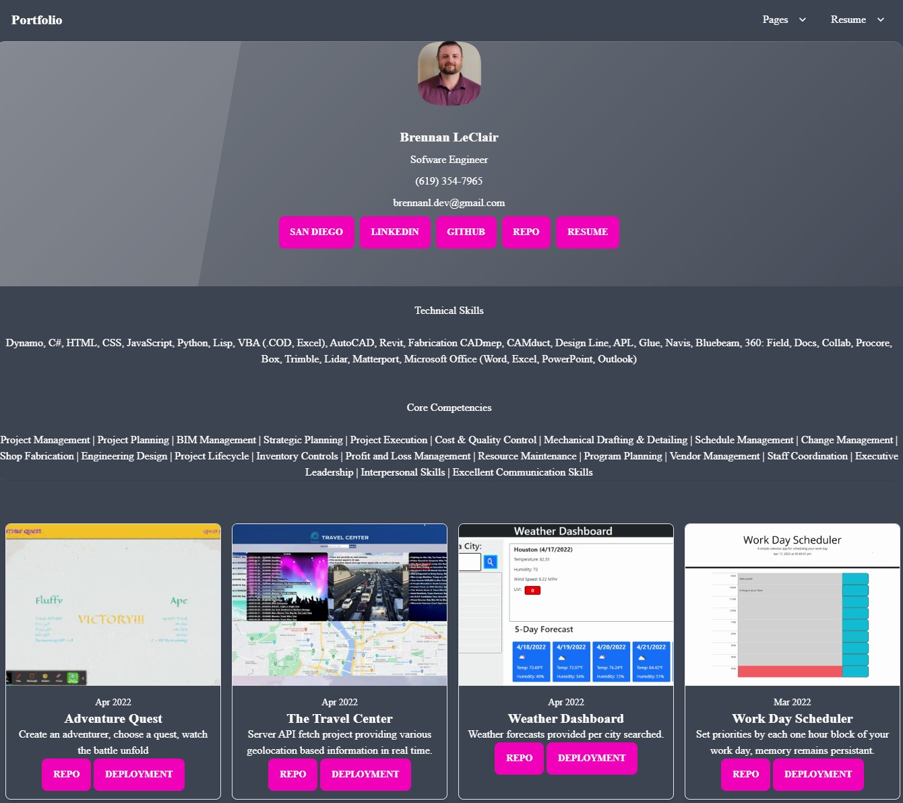

# Portfolio

## Description

Welcome to my portfolio! Please peruse at your leisure and reach out with any questions you may have.


## Link to Deployed Application

[Click to view the deployed application](https://blec-portfolio.herokuapp.com/)

[Click to view the portfolio repository](https://github.com/Blec333/portfolio)





## Table of contents


- [Technologies Employed](#technologies-employed)
- [Key Functions](#key-functions)
- [Final Product](#final-product)
- [License](#license)
- [Contact/Questions](#questions)


## Technologies Employed


| Techlogy             | Implementation/Use       |
| -------------------- | ------------------------ |
| Node.js              | JavaScript runtime       |
| Node Package Manager | Manage node packages     |
| dotenv               | Environment Variables    |
| Express.js           | Web framework            |
| sequelize            | ORM                      |
| Heroku               | Deployment               |
| Handlebars           | Template and View engine |


## Key Functionality


```html
        <div class="carousel carousel-center p-4 space-x-4 bg-neutral rounded-box">
          <div class="carousel-item">
            <div class="bg-neutral rounded-lg border shadow-md max-w-xs overflow-hidden rounded-box">
              
              <div class="p-3">
                <span class="text-sm text-primary-content">Apr 2022</span>
                <h3 class="font-semibold text-xl leading-6 text-primary-content">Adventure Quest</h3>
                <p class="text-primary-content">Create an adventurer, choose a quest, watch the battle unfold</p>
                <button class="btn btn-secondary text-primary-content"
                  onclick="window.open('https://github.com/Blec333/adventureQuest' + location.search)">Repo</button>
                <button class="btn btn-secondary text-primary-content"
                  onclick="window.open('https://warm-falls-71074.herokuapp.com/' + location.search)">Deployment</button>
              </div>
            </div>
          </div>
```


## Final Product


## License

This software is licensed under the MIT [LICENSE](./LICENSE)

MIT License

Copyright (c) 2022 Brennan LeClair

Permission is hereby granted, free of charge, to any person obtaining a copy
of this software and associated documentation files (the "Software"), to deal
in the Software without restriction, including without limitation the rights
to use, copy, modify, merge, publish, distribute, sublicense, and/or sell
copies of the Software, and to permit persons to whom the Software is
furnished to do so, subject to the following conditions:

The above copyright notice and this permission notice shall be included in all
copies or substantial portions of the Software.

THE SOFTWARE IS PROVIDED "AS IS", WITHOUT WARRANTY OF ANY KIND, EXPRESS OR
IMPLIED, INCLUDING BUT NOT LIMITED TO THE WARRANTIES OF MERCHANTABILITY,
FITNESS FOR A PARTICULAR PURPOSE AND NONINFRINGEMENT. IN NO EVENT SHALL THE
AUTHORS OR COPYRIGHT HOLDERS BE LIABLE FOR ANY CLAIM, DAMAGES OR OTHER
LIABILITY, WHETHER IN AN ACTION OF CONTRACT, TORT OR OTHERWISE, ARISING FROM,
OUT OF OR IN CONNECTION WITH THE SOFTWARE OR THE USE OR OTHER DEALINGS IN THE
SOFTWARE.


## Questions?

Please visit

[Brennan (blec333)](https://github.com/Blec333)


### Acknowledgements

©Brennan LeClair
